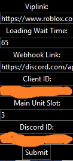

# Anime-Adventures-Ada-Macro
Map : Marine / Wave : ~25

# Requirements 
1920 x 1080
Poseidon Unit

# Simple instruction
- Go to [Discord Dev Portal](https://discord.com/developers/applications), create new application and copy Application ID (Put it in Cilent ID later)
- Get your Webhook link and your Discord ID + Roblox Vip Link
- Run file, wait for it install needed libraries and put everything in gui.
- After this you can change "installedlibs" variable to True.
- Loading Wait Time is for Lobby only.
- Result should look like this.
- 
- Copy these ingame settings.
- 
# Known issues
- "Pyautogui was unable to import pyscreeze" do
- ```python
  pip install pillow
  ```
- Macro choosing sand village
- Don't use full screen(F11)

  
